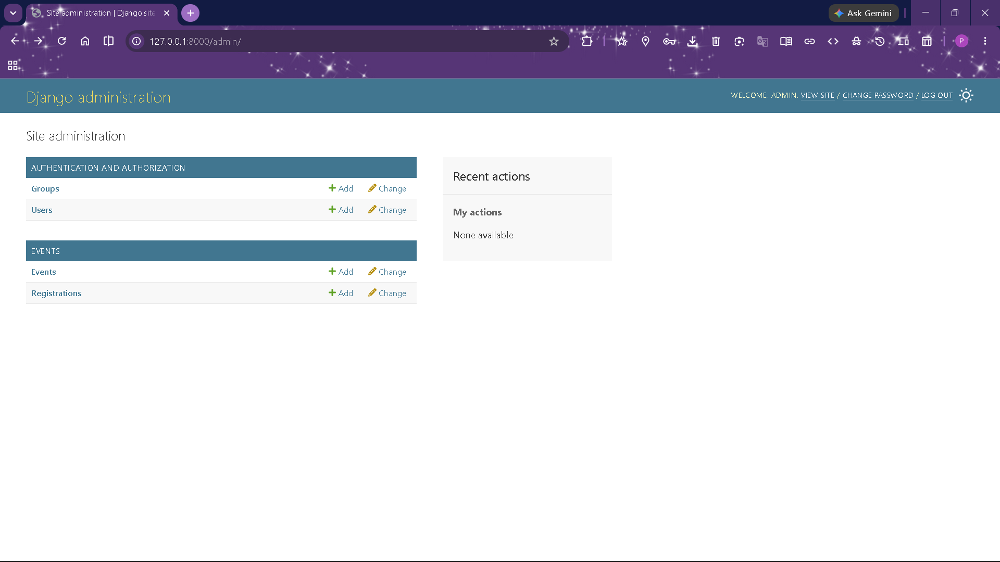
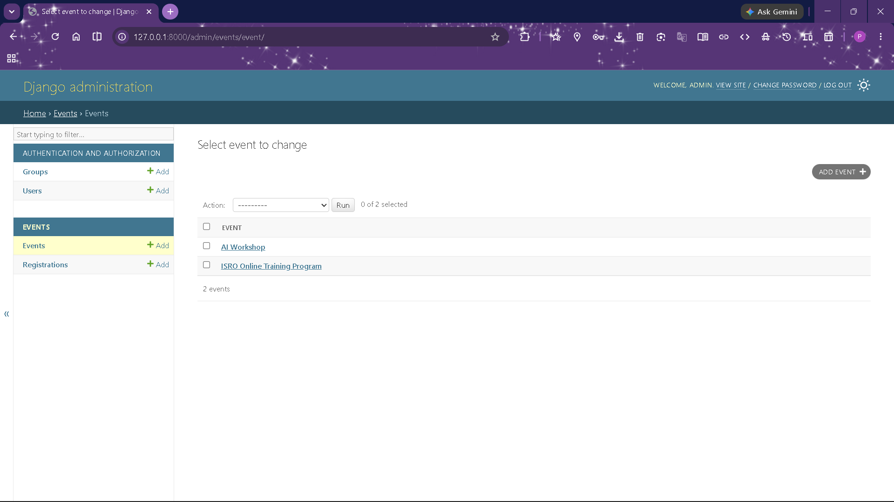
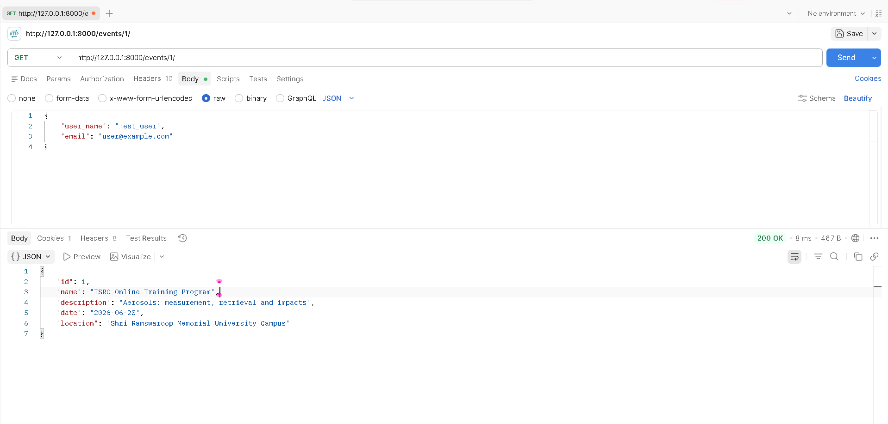
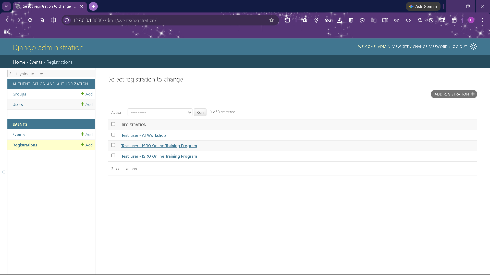
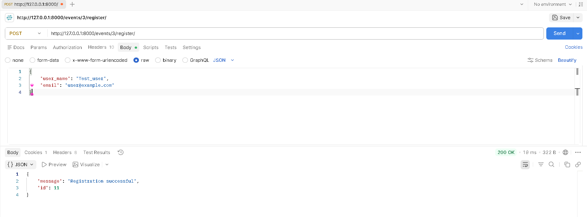

# CodeAlpha Event Registration System

## 📌 Project Overview

The Event Registration System is a backend web application developed using Django and SQLite. It allows users to view available events, register for events, view registrations, and cancel registrations through RESTful API endpoints.

This project was developed as part of the CodeAlpha Backend Development Internship.

---

## 🚀 Features

* View all available events
* View event details
* Register for an event
* View all registrations
* Cancel registrations
* Django Admin Panel for event management
* SQLite database integration
* REST API architecture

---

## 🛠️ Technologies Used

* Python
* Django
* Django REST Framework
* SQLite
* Git & GitHub
* Postman

---

## 📂 Project Structure

```plaintext
CodeAlpha_EventRegistrationSystem/

├── backend/                  # Django project configuration
│   ├── __init__.py
│   ├── settings.py           # Project settings
│   ├── urls.py               # Main URL routing
│   ├── asgi.py
│   └── wsgi.py
│
├── events/                   # Event Registration application
│   ├── migrations/
│   │   ├── __init__.py
│   │   └── 0001_initial.py
│   ├── __init__.py
│   ├── admin.py              # Admin panel configuration
│   ├── apps.py
│   ├── models.py             # Database models
│   ├── serializers.py        # DRF serializers
│   ├── tests.py
│   └── views.py              # API logic
|
├── screenshots/ 
│ ├── 01-events-admin.png 
│ ├── 02-registrations-admin.png 
│ ├── 03-events-api.png 
│ ├── 04-registration-success.png 
│ ├── 05-registrations-api.png 
│ └── 06-cancel-registration.png
|
├── manage.py                 # Django management script
├── requirements.txt          # Project dependencies
├── README.md                 # Project documentation
└── .gitignore                # Ignored files and folders

```

---

## ⚙️ Installation

1. Clone the repository

```bash
git clone https://github.com/PawanKumaCode/CodeAlpha_EventRegistrationSystem.git
```

2. Navigate to the project directory

```bash
cd CodeAlpha_EventRegistrationSystem
```

3. Create virtual environment

```bash
python -m venv venv
```

4. Activate virtual environment

Windows:

```bash
venv\Scripts\Activate.ps1
```

5. Install dependencies

```bash
pip install -r requirements.txt
```

6. Run migrations

```bash
python manage.py migrate
```

7. Start server

```bash
python manage.py runserver
```

---

## 📡 API Endpoints

### View All Events

```http
GET /events/
```

### View Event Details

```http
GET /events/<event_id>/
```

### Register for Event

```http
POST /events/<event_id>/register/
```

Sample Request Body:

```json
{
    "user_name": "John Doe",
    "email": "john@example.com"
}
```

### View Registrations

```http
GET /registrations/
```

### Cancel Registration

```http
DELETE /registrations/<registration_id>/cancel/
```

---

## 📸 Project Screenshots

### 1. Events Management (Admin Panel)
Displays all events available in the system. Administrators can create, update, and manage event information through the Django Admin Panel.


### 2. Registrations Management (Admin Panel)
Shows all user registrations stored in the database along with participant details and associated events.

### 3. View All Events API
REST API endpoint that retrieves all available events from the database in JSON format.

### 4. Event Registration API
Demonstrates successful event registration by submitting user details and generating a registration record.

### 5. View Registrations API
Returns all registration records, allowing administrators to verify participant registrations.

<!-- ### 6. Cancel Registration API -->
<!-- Allows users to cancel an existing registration using the registration ID and receive a confirmation response. -->
---


## 🔄 How the System Works

1. The admin creates events through the Django Admin Panel.
2. Users can view all available events using the Event List API.
3. Users can view details of a specific event using the Event Detail API.
4. Users submit their name and email through the Registration API.
5. The registration is stored in the SQLite database and linked to the selected event.
6. Users can view registrations through the Registrations API.
7. Users can cancel their registration using the Cancel Registration API.
8. Event organizers can manage events and registrations through the Django Admin Panel.

---
### Workflow

Admin Creates Event
      
       ↓
User Views Events
      
       ↓
User Registers for Event
      
       ↓
Registration Stored in Database
      
       ↓
User Views Registration
      
       ↓
User Cancels Registration (Optional)


 ---
 


CodeAlpha Backend Development Internship Project
